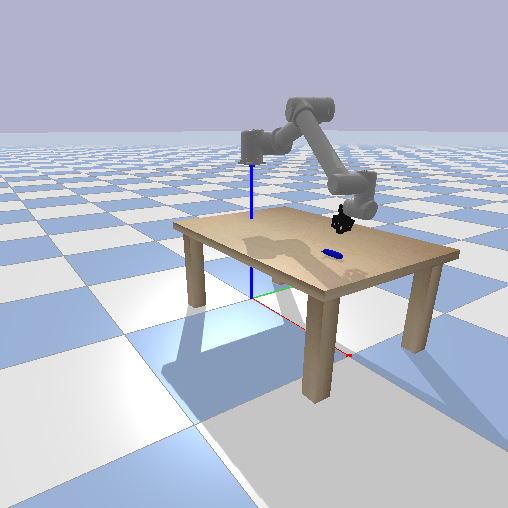

# UR10 robot with robotiq_2f_85 gripper

This is a robotic env like gym FetchPickAndPlace-v1 but with UR10 robot arm and robotiq 2f 85 gripper. It uses pybullet simulator to simulate physical interactions between robot and environment.   


# Generate URDF

To modify URDF model install ros, [universal_robot](https://github.com/ros-industrial/universal_robot) and [robotiq](https://github.com/ros-industrial/robotiq)  
in catkin_ws do:
* ```source devel/setup.bash```
* ```rosrun xacro xacro ur10_robot_constr.urdf.xacro > my_robot.urdf```
* ```check_urdf my_robot.urdf```

# Enviroment
### Observation:
```
obs[:3] = gripper_position
obs[3:6] = gripper_orientation
obs[6:9] = gripper_velocity
obs[9:12] = gripper_angular_velocity
obs[12:15] = object_position - gripper_position
obs[15:18] = object_orientation
obs[18:21] = object_velocity
obs[21:24] = object_angular_velocity
obs[24] = gripper_open_value
 ```

### Action:
```
action[0:3] = delta x,y,z gripper position
action[3] - open / close gripper
```

### Reward:

#### dense reward:
```
reward = 1 - |object_position - desired_position| - |object_position - gripper_position|
```
#### space reward:
```
reward = 0 if goal achieved -1 othervise
```

# Run

### evaluate script agent
```
python3 main.py --agent script --mode eval
```

### visualize script agent
``` 
python3 main.py --agent script --mode viz
```

### train ppo agent
``` 
python3 main.py --agent ppo --mode train
```

### evaluate ppo agent
```
python3 main.py --agent ppo --mode eval
```

### visualize ppo agent
```
 python3 main.py --agent ppo --mode viz
```


# Evaluation results
 agent | reward | success | 
| ------------- | ------------- | ------------- | 
| scripted | 123.8  | 0.97  | 
| PPO | 63  | 0.1  | 
| random | 42  | 0  | 


# Video
 scripted agent | PPO agent | random agent | 
| ------------- | ------------- | ------------- | 
| [scripted](video/scripted_agent.mp4) | [ppo](video/ppo_agent.mp4)  | [random](video/random_agent.mp4)  |
